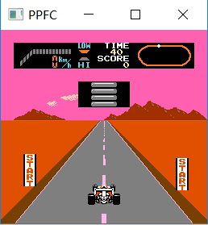

# PPFC

A simple fc simulator implemented in c++11

   

# INFO

- 目前仅支持Mapper000，但并不保证其所有游戏能玩
- 支持自适应窗口

# Usage

- ppfc.exe \<nes rom path\>
- 用鼠标将ROM拖曳到ppfc.exe

# Controller

**Player 1**

| Button | Key  |
| :----: | :--: |
|   Up   |  W   |
|  Down  |  S   |
|  Left  |  A   |
| Right  |  D   |
|   A    |  J   |
|   B    |  K   |
| Select |  U   |
| Start  |  I   |

**Player 2**

| Button |   Key    |
| :----: | :------: |
|   Up   |    ↑     |
|  Down  |    ↓     |
|  Left  |    ←     |
| Right  |    →     |
|   A    | Keypad 2 |
|   B    | Keypad 3 |
| Select | Keypad 5 |
| Start  | Keypad 6 |

**Other**

| Action |   Key    |
| :----: | :------: |
| Reset  | Ctrl + 3 |

# Environment

- SDL2-2.0.12
- vs2017
- Win10

# make

本项目使用`vs2017`，用`Release x86`生成解决方案，然后将library/SDL2-2.0.12/lib/x86/SDL2.dll 复制到ppfc.exe 所在目录

# TODO

- [ ] Save/Load
- [ ] APU
- [ ] Trainer (金手指)

## Reference

- [StepFC](https://github.com/dustpg/StepFC)
- http://obelisk.me.uk/6502/
- [Nesdev Wiki](http://wiki.nesdev.com/w/index.php/Nesdev_Wiki)