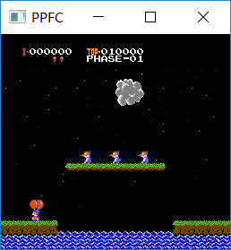
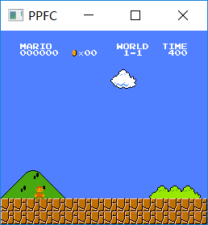
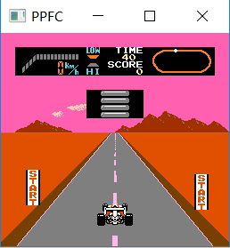

# PPFC

A simple fc emulator implemented in c++11 using SDL2 (for Windowns and Linux)

   

# Info

- 目前仅支持Mapper000，但并不保证其所有游戏能玩
- 支持自适应窗口
- 支持 Linux 平台，不过仅在Ubuntu18上测试过
- 支持 mac 平台

# Environment

- SDL2-2.0.12

# Make

- Windowns: 

  - vs2017：
    - 用`Release x86`生成解决方案，然后将lib/SDL2-2.0.12/lib/x86/SDL2.dll 复制到ppfc.exe 所在目录
    - 现已不维护
  - mingw64：
    - makefile 文件已经支持编译

- Linux: 需要另外安装SDL2
    - makefile 文件已经支持编译
  
- Mac: 需要另外安装SDL2
  - makefile 文件已经支持编译

# Usage

- <output 文件> \<nes rom path\>
- 用鼠标将 ROM 拖曳到 output 文件

# Controller

**Player 1**

| Button | Key  |
| :----: | :--: |
|   Up   |  W   |
|  Down  |  S   |
|  Left  |  A   |
| Right  |  D   |
|   A    |  J   |
|   B    |  K   |
| Select |  U   |
| Start  |  I   |

**Player 2**

| Button |   Key    |
| :----: | :------: |
|   Up   |    ↑     |
|  Down  |    ↓     |
|  Left  |    ←     |
| Right  |    →     |
|   A    | Keypad 2 |
|   B    | Keypad 3 |
| Select | Keypad 5 |
| Start  | Keypad 6 |

**Other**

| Action |   Key    |
| :----: | :------: |
| Reset  | Ctrl + 3 |

# TODO

- [ ] Save/Load
- [ ] APU
- [ ] Trainer (金手指)
- [ ] 将该项目移植到stm32或esp32上运行

# Reference

- [StepFC](https://github.com/dustpg/StepFC)
- http://obelisk.me.uk/6502/
- [Nesdev Wiki](http://wiki.nesdev.com/w/index.php/Nesdev_Wiki)